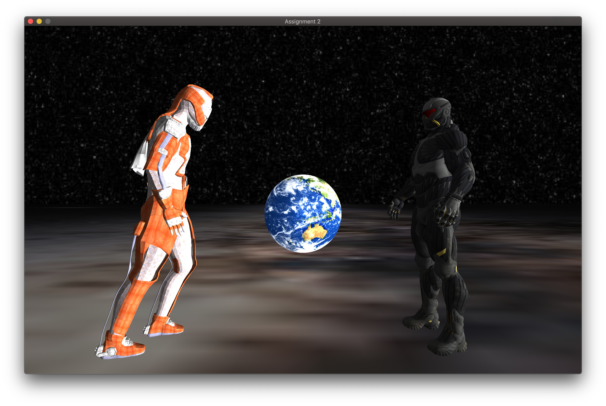

# CSCI 3260 Assignment 2

> 1155123308 Wentao Zhu

## Description

As you may know, modern OpenGL is poorly supported on macOS 10.14. To be more specific, the issue of FreeGLUT and OpenGL 3+ (required by GLSL) can not be not fully resolved. Therefore, I used a open source framework [Glitter](https://github.com/Polytonic/Glitter), which used [GLFW](http://www.glfw.org/documentation.html) as UI library and support modern OpenGL in a plug-and-play fashion.


[Glitter](https://github.com/Polytonic/Glitter) features cross-platform reliability and is therefore recommended by [Learn OpenGL](https://learnopengl.com). Technically, it simply packs the relevant libraries and linked them properly. I used a different skeleton code with identical logic. Since only the UI library is different from the skeleton code provided, the logistic of core functions are quite similar.


### How you can test the project:

```bash
git clone --recursive https://github.com/Walter0807/CG-Assignment.git
cd CG-Assignment-1/Build
```

Now generate a project file or makefile for your platform. If you want to use a particular IDE, make sure it is installed; don't forget to set the Start-Up Project in Visual Studio or the Target in Xcode.

```bash
# UNIX Makefile
cmake ..

# Mac OSX
cmake -G "Xcode" ..

# Microsoft Windows
cmake -G "Visual Studio 14" ..
cmake -G "Visual Studio 14 Win64" ..
...
```

Then put the attached files to corresponding root directorty, compile and run.


Dependency: [cmake](http://www.cmake.org/download/)

You can check out the video [here](https://drive.google.com/open?id=1K3CZNhW_zi7FDHK1qYolUyRLNrHdQgH_).

If you have any questions, please [contact me](mailto:walterzhu@pku.edu.cn). I can also show it to you in person.

## Implementation



### Objects

- A superman is fighting agaist an enemy for the fragile planet.
- Three .obj models are loaded and textured.

### Interaction

- As the insturction writes.
- Control the character on the left using arrow keys, control the character on the right using I/J/K/L

 ### Implementation

- In this project, all the basic requirements are fulfilled. 

- Moreover, a skybox is rendered. A directional light (from right side) and a spotlight (from the camera) are implemented.


